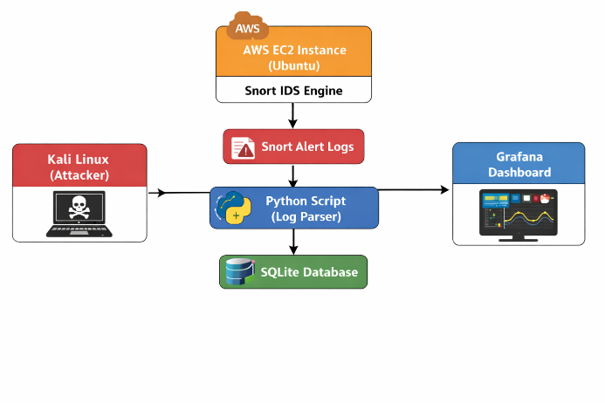
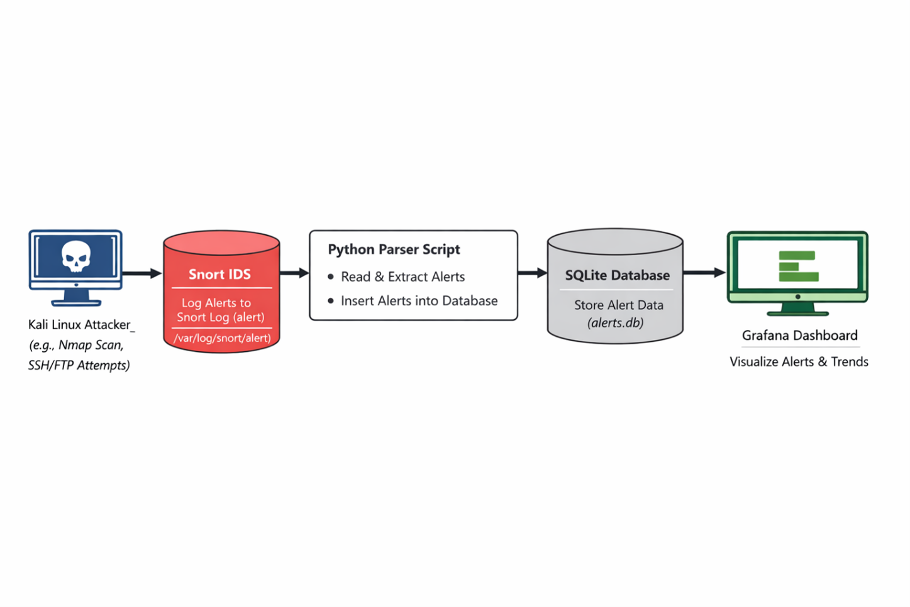
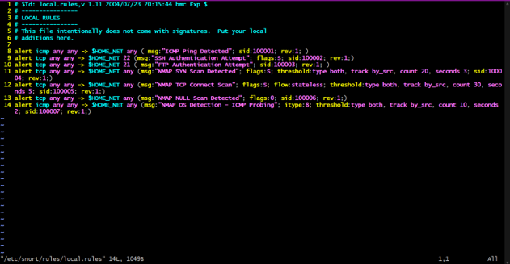
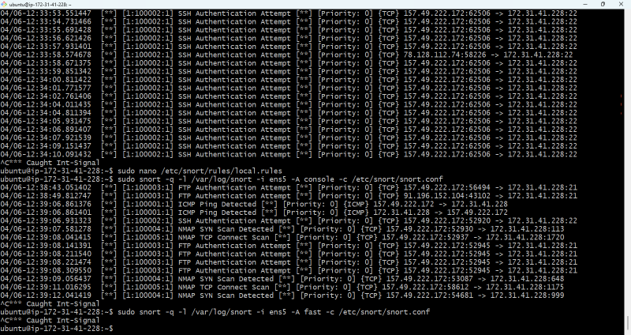
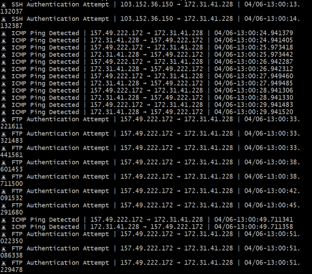
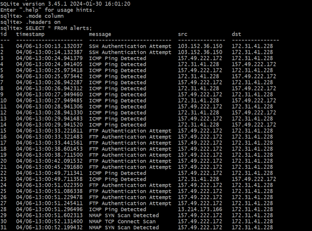
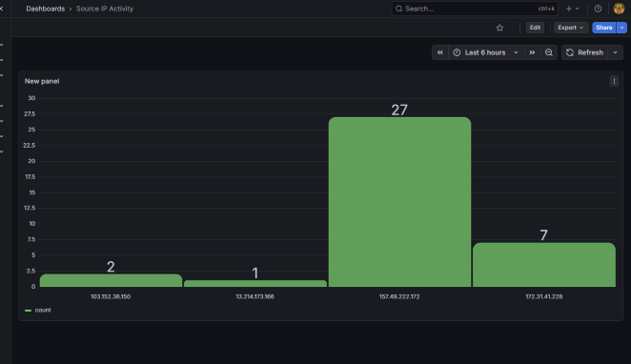
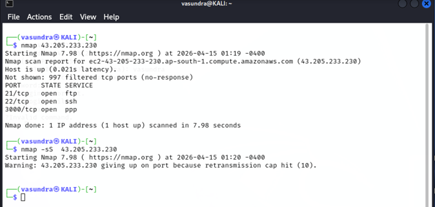

# Cloud-Based Intrusion Detection System

A signature-based Intrusion Detection System (IDS) developed using Snort, Python, SQLite, and Grafana to detect and visualize network security alerts.

## Project Overview

This project uses Snort to monitor network traffic and detect suspicious activities using custom detection rules.

Snort generates alerts when suspicious traffic is detected. A Python script processes the alerts and stores relevant information in SQLite. Grafana is then used to visualize the security events.

## Architecture

Kali Linux → Snort IDS → Python → SQLite → Grafana

## Technologies Used

- Snort IDS
- Python
- SQLite
- Grafana
- Ubuntu Linux
- Kali Linux
- AWS EC2
- Network Security

## Detection Rules

The project includes custom rules to detect:

- ICMP Ping
- SSH Authentication Attempts
- FTP Authentication Attempts
- Nmap SYN Scan
- Nmap TCP Connect Scan

## Python Automation

The `snort_reader.py` script reads and processes Snort alert information for further analysis and storage.

## Grafana Dashboard

Grafana is used to visualize detected security events, including:

- Attack counts
- Alert types
- Source IP activity
- Security events

## AWS Implementation

The IDS was deployed as a proof of concept on an AWS EC2 Ubuntu instance using Snort, Python, SQLite, and Grafana.

## Testing

The IDS was tested against different types of network activity, including:

- ICMP Ping
- SSH connection attempts
- FTP connection attempts
- Nmap SYN scans
- Nmap TCP Connect scans

The generated Snort alerts were processed using Python and visualized through Grafana.

## Results

The system successfully detected the configured network activities and generated security alerts. The alerts were processed and stored in SQLite, while Grafana was used to visualize the detected attack activity.

## Screenshots

### Architecture


### Data Flow


### Snort Rules


### Snort Alerts


### Python Alert Processing


### SQLite Database


### Grafana Dashboard


### Port Scan Detection


## Project Structure

```text
Cloud-Based-Intrusion-Detection-System/
│
├── README.md
├── grafana/
│   └── grafana-dashboard.json
├── python/
│   └── snort_reader.py
├── screenshots/
│   ├── architecture.png
│   ├── data-flow.png
│   ├── database.png
│   ├── grafana-dashboard-1.png
│   ├── port-scan.png
│   ├── python-parser.png
│   ├── snort-alerts.png
│   └── snort-rules.png
└── snort/
    └── local.rules# Cloud-based-intrusion-detection-system
Cloud-based Intrusion Detection System using Snort, Python automation, SQLite, and Grafana.
